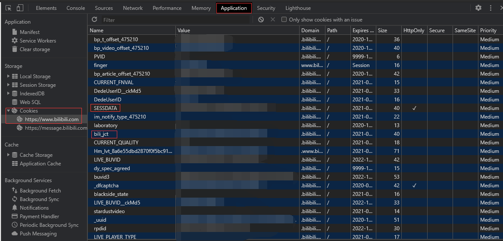

# bilibili-message-helper

B站舰长私信群发小工具

## 使用说明

### 设置

请先在`setting.json`中完成基本设置，下面是设置选项的说明：

```
{
    "UID": 账号数字ID,
    "RoomID": 房间号（长）,
    "SESSDATA": "SESSDATA value",
    "bili_jct": "bili_jct value"
}
```

其中`SESSDATA`和`bili_jct`的内容，可以通过Chrome浏览器获取，步骤如下所示：

1. 首先请确保已经登录b站

2. 在打开b站页面的情况下，按下F12，按下图所示即可找到对应的值：



**警告：SESSDATA的值请勿向他人透露，否则可能会导致账号被盗**

填写好`setting.json`后，请将`template.txt`中的内容自由进行改写，其中`{name}`后续将会被自动替换为对应的舰长ID；`{code}`会自动替换为兑换码。例如：

```
亲爱的{name}：
这是9月的舰长礼物
下载地址：xxxxxxxx
兑换码：{code}
```

将会被替换为：

```
亲爱的某舰长：
这是9月的舰长礼物
下载地址：xxxxxxxx
兑换码：D34SgJ
```

然后将兑换码按每行一个的格式，保存到codes.txt中

### 运行

如果已经装有`Python3`，那么设置好后，直接运行下列命令即可：

```
python3 main.py
```

如果你的电脑上没有`Python3`环境，也可[在这里](https://github.com/Xinrea/bilibili-message-helper/releases/latest)选择下载打包好的可执行程序版本（由于程序运行涉及敏感信息，请不要在其它地方下载可能被修改过的程序）
